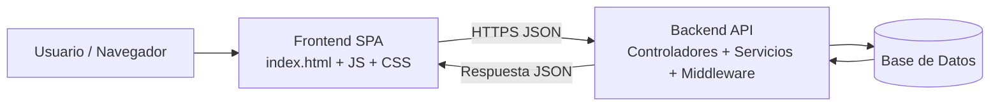

# Maiquel - Gestor de Tareas en Espanol

## Autores

- Urukais Klick
- Manuel Casimiro Carrasco

Aplicacion web completa con arquitectura cliente-servidor de tres capas:

- Presentacion: `frontend`
- Logica de negocio: `backend`
- Persistencia de datos: archivos JSON en `backend/data`

Interfaz moderna, responsive y totalmente en espanol.

## Requisitos

- Node.js 18 o superior
- npm 9 o superior
- Docker Desktop (opcional, recomendado para despliegue local)

## Estructura del Proyecto

```text
/frontend
  index.html
  /css
    main.css
  /js
    main.js
    /modules
      api.js
      router.js
      state.js
      ui.js

/backend
  package.json
  .env.example
  /src
    app.js
    server.js
    /config
      env.js
    /controllers
      auth.controller.js
      task.controller.js
    /data
      database.js
      paths.js
    /middleware
      auth.middleware.js
      error.middleware.js
    /repositories
      task.repository.js
      user.repository.js
    /routes
      auth.routes.js
      task.routes.js
    /services
      auth.service.js
      task.service.js
```

## Instalacion y Ejecucion

1. Instala dependencias del backend:

```bash
cd backend
npm install
```

2. Crea tu archivo de entorno:

```bash
cp .env.example .env
```

Si usas PowerShell en Windows:

```powershell
Copy-Item .env.example .env
```

3. Inicia el backend:

```bash
npm run dev
```

La API quedara en: `http://localhost:3000`

4. Abre el frontend con un servidor estatico (por ejemplo Live Server) apuntando a:

`frontend/index.html`

> Importante: el frontend espera la API en `http://localhost:3000/api`.

## Ejecucion con Docker (nivel produccion local)

1. Crear el archivo de entorno del backend:

```powershell
Copy-Item backend/.env.example backend/.env
```

2. Levantar todos los servicios:

```bash
docker compose up --build -d
```

3. Acceder a la aplicacion:

- Frontend: `http://localhost:8080`
- Backend (salud): `http://localhost:3000/api/salud`

4. Detener servicios:

```bash
docker compose down
```

## Calidad de codigo (Sprint 1)

El proyecto incluye estandares de lint y formato para backend y frontend.

### Backend

```bash
cd backend
npm install
npm run lint
npm run format:check
```

### Frontend

```bash
cd frontend
npm install
npm run lint
npm run format:check
```

### Script unificado por modulo

En ambos modulos existe:

- `npm run check` -> ejecuta lint + validacion de formato

## Arquitectura por Capas

### 1) Frontend (Presentacion)

El frontend se sirve directamente al navegador desde `index.html` y esta compuesto por:

- `HTML5` para estructura semantica
- `CSS3` para estilos y diseno responsive
- `JavaScript ES6+` para interaccion, estado, rutas y comunicacion con API

Responsabilidades principales:

- Manipulacion del DOM y eventos
- Validaciones de formularios en tiempo real
- Gestion de estado de interfaz
- Enrutamiento cliente (SPA con History API)
- Consumo de API con `fetch` o `axios`
- Almacenamiento temporal (`localStorage`/`sessionStorage`)

Estructura sugerida:

```text
/frontend
  index.html
  /css
    main.css
    responsive.css
  /js
    main.js
    modules/
      api.js
      ui.js
      state.js
      router.js
  /assets
    imagenes/
    fuentes/
```

### 2) Backend (Logica de Negocio)

El backend expone una API (preferentemente REST) y centraliza reglas de negocio.

Componentes clave:

- Servidor HTTP (por ejemplo, Node.js + Express)
- Rutas/endpoints de negocio
- Controladores (entrada/salida HTTP)
- Servicios/casos de uso (reglas de negocio)
- Repositorios/modelos (acceso a datos)
- Middlewares (auth, logs, CORS, errores, rate-limit)

Ejemplo de endpoints:

- `GET /api/usuarios`
- `POST /api/usuarios`
- `PUT /api/usuarios/:id`
- `DELETE /api/usuarios/:id`
- `POST /api/login`

### 3) Persistencia de Datos

En esta version se usa persistencia simple con archivos JSON:

- `backend/data/usuarios.json`
- `backend/data/tareas.json`

La capa de repositorios abstrae el acceso para facilitar una futura migracion a SQL o NoSQL.

## Flujo de Comunicacion Frontend-Backend

1. El usuario abre la aplicacion y se carga `index.html`.
2. `main.js` inicializa UI, eventos y estado.
3. Ante una accion del usuario, el frontend envia peticion HTTP al backend.
4. El backend valida, procesa reglas de negocio y responde JSON.
5. El frontend actualiza el DOM sin recargar pagina.

Todo el intercambio usa JSON y asincronia (`async/await`).

## Diagrama de Alto Nivel



## Endpoints Disponibles

### Salud

- `GET /api/salud`

### Autenticacion

- `POST /api/auth/registro`
- `POST /api/auth/login`

### Tareas (requiere token Bearer)

- `GET /api/tareas`
- `POST /api/tareas`
- `PUT /api/tareas/:id`
- `DELETE /api/tareas/:id`

## Seguridad

Controles recomendados:

- Autenticacion JWT (Bearer)
- Hash de contrasenas con `bcrypt`
- Validacion de entradas con `Zod`
- `Helmet` para cabeceras de seguridad
- CORS restringido por entorno
- Rate limiting configurable por variables de entorno
- Sanitizacion basica en renderizado frontend (escape de HTML)

## Funcionalidades Incluidas

- Registro e inicio de sesion de usuarios
- Sesion persistente en navegador con `localStorage`
- Creacion, listado, actualizacion y eliminacion de tareas
- Cambio de estado de tarea (completada/pendiente)
- Interfaz moderna con colores actuales y diseno adaptable

## Gestion del Proyecto

- Roadmap de evolucion: `ROADMAP.md`
- Integracion continua: `.github/workflows/ci.yml`
- Plantillas de incidencias: `.github/ISSUE_TEMPLATE/`
- Contenedores: `docker-compose.yml`, `backend/Dockerfile`, `frontend/Dockerfile`

## Resumen Ejecutivo

La aplicacion se inicia desde un unico `index.html`.
El frontend, desarrollado con `HTML`, `CSS` y `JavaScript`, gestiona la experiencia interactiva del usuario.
El backend expone una API (`REST` o `GraphQL`) encargada de la logica de negocio y del acceso a la base de datos.
La comunicacion entre capas se realiza de forma asincrona mediante `JSON`, garantizando una arquitectura modular, segura y preparada para produccion.

## Siguiente Paso Funcional

Tras definir la arquitectura, el siguiente paso es concretar el alcance funcional del producto con una hoja clara:

### 1) Casos de Uso e Historias de Usuario

Definir perfiles y acciones principales:

- Usuario invitado: ver pantalla de acceso y registrarse.
- Usuario registrado: iniciar sesion, gestionar sus tareas y actualizar su perfil.
- Administrador (opcional): ver usuarios y aplicar acciones de supervision.

Casos iniciales recomendados para Maiquel:

- Registrar usuario
- Iniciar sesion
- Crear tarea
- Marcar tarea como completada/pendiente
- Editar tarea
- Eliminar tarea
- Filtrar tareas por estado/prioridad

### 2) Modelo de Datos (Conceptual)

Entidades sugeridas:

- `usuarios`: id, nombre, email, password_hash, rol, fecha_registro
- `tareas`: id, titulo, descripcion, estado, prioridad, fecha_creacion, fecha_vencimiento, id_usuario
- `categorias` (opcional): id, nombre, color

Relaciones y restricciones:

- Un usuario tiene muchas tareas
- Una tarea pertenece a un usuario
- Una tarea puede pertenecer a una categoria (opcional)
- `email` unico por usuario
- Claves foraneas e indices sobre campos de busqueda frecuentes

### 3) Contrato de API

Endpoints base:

- `POST /api/auth/registro` -> crear cuenta
- `POST /api/auth/login` -> devolver JWT
- `GET /api/tareas` -> listar tareas del usuario autenticado (idealmente paginado)
- `POST /api/tareas` -> crear tarea
- `PUT /api/tareas/:id` -> actualizar tarea
- `DELETE /api/tareas/:id` -> eliminar tarea

Administracion (opcional):

- `GET /api/admin/usuarios`

### 4) Vistas y Flujo del Frontend

Pantallas objetivo:

- Login / registro
- Dashboard con listado, filtros y acciones rapidas
- Formulario de crear/editar tarea
- Perfil de usuario
- Panel de administracion (si hay roles)

Interacciones clave:

- Al crear tarea, actualizar listado sin recargar
- Mensajes de error/exito claros para toda accion
- Navegacion SPA entre vistas

### 5) Plan de Desarrollo por Fases

- Fase 0: base del proyecto y convenciones
- Fase 1: autenticacion JWT (registro/login)
- Fase 2: CRUD de tareas + reglas de propietario
- Fase 3: frontend de acceso y consumo de API
- Fase 4: dashboard y CRUD dinamico
- Fase 5: pruebas, seguridad y responsive
- Fase 6: despliegue en staging y luego produccion

### 6) Herramientas Complementarias

- Variables de entorno en `.env`
- Documentacion de API con OpenAPI/Swagger (recomendado)
- Logging de peticiones y errores
- Manejo global de errores en backend y frontend

## Nota de Responsabilidad Tecnica

La arquitectura y su implementacion han sido concebidas por Urukais Klick (diseno tecnico general, frontend y backend), junto con Manuel Casimiro Carrasco (desarrollo, integracion y optimizacion), garantizando modularidad, mantenibilidad y escalabilidad del sistema.
