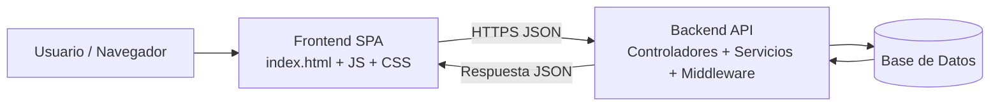

# Maiquel - Gestor de Tareas en Espanol

## Autores

- Urukais Klick
- Manuel Casimiro Carrasco

Aplicacion web completa con arquitectura cliente-servidor de tres capas:

- Presentacion: `frontend`
- Logica de negocio: `backend`
- Persistencia de datos: archivos JSON en `backend/data`

Interfaz moderna, responsive y totalmente en espanol.

## Requisitos

- Node.js 18 o superior
- npm 9 o superior

## Estructura del Proyecto

```text
/frontend
  index.html
  /css
    main.css
  /js
    main.js
    /modules
      api.js
      router.js
      state.js
      ui.js

/backend
  package.json
  .env.example
  /src
    app.js
    server.js
    /config
      env.js
    /controllers
      auth.controller.js
      task.controller.js
    /data
      database.js
      paths.js
    /middleware
      auth.middleware.js
      error.middleware.js
    /repositories
      task.repository.js
      user.repository.js
    /routes
      auth.routes.js
      task.routes.js
    /services
      auth.service.js
      task.service.js
```

## Instalacion y Ejecucion

1. Instala dependencias del backend:

```bash
cd backend
npm install
```

2. Crea tu archivo de entorno:

```bash
cp .env.example .env
```

Si usas PowerShell en Windows:

```powershell
Copy-Item .env.example .env
```

3. Inicia el backend:

```bash
npm run dev
```

La API quedara en: `http://localhost:3000`

4. Abre el frontend con un servidor estatico (por ejemplo Live Server) apuntando a:

`frontend/index.html`

> Importante: el frontend espera la API en `http://localhost:3000/api`.

## Arquitectura por Capas

### 1) Frontend (Presentacion)

El frontend se sirve directamente al navegador desde `index.html` y esta compuesto por:

- `HTML5` para estructura semantica
- `CSS3` para estilos y diseno responsive
- `JavaScript ES6+` para interaccion, estado, rutas y comunicacion con API

Responsabilidades principales:

- Manipulacion del DOM y eventos
- Validaciones de formularios en tiempo real
- Gestion de estado de interfaz
- Enrutamiento cliente (SPA con History API)
- Consumo de API con `fetch` o `axios`
- Almacenamiento temporal (`localStorage`/`sessionStorage`)

Estructura sugerida:

```text
/frontend
  index.html
  /css
    main.css
    responsive.css
  /js
    main.js
    modules/
      api.js
      ui.js
      state.js
      router.js
  /assets
    imagenes/
    fuentes/
```

### 2) Backend (Logica de Negocio)

El backend expone una API (preferentemente REST) y centraliza reglas de negocio.

Componentes clave:

- Servidor HTTP (por ejemplo, Node.js + Express)
- Rutas/endpoints de negocio
- Controladores (entrada/salida HTTP)
- Servicios/casos de uso (reglas de negocio)
- Repositorios/modelos (acceso a datos)
- Middlewares (auth, logs, CORS, errores, rate-limit)

Ejemplo de endpoints:

- `GET /api/usuarios`
- `POST /api/usuarios`
- `PUT /api/usuarios/:id`
- `DELETE /api/usuarios/:id`
- `POST /api/login`

### 3) Persistencia de Datos

En esta version se usa persistencia simple con archivos JSON:

- `backend/data/usuarios.json`
- `backend/data/tareas.json`

La capa de repositorios abstrae el acceso para facilitar una futura migracion a SQL o NoSQL.

## Flujo de Comunicacion Frontend-Backend

1. El usuario abre la aplicacion y se carga `index.html`.
2. `main.js` inicializa UI, eventos y estado.
3. Ante una accion del usuario, el frontend envia peticion HTTP al backend.
4. El backend valida, procesa reglas de negocio y responde JSON.
5. El frontend actualiza el DOM sin recargar pagina.

Todo el intercambio usa JSON y asincronia (`async/await`).

## Diagrama de Alto Nivel



## Endpoints Disponibles

### Salud

- `GET /api/salud`

### Autenticacion

- `POST /api/auth/registro`
- `POST /api/auth/login`

### Tareas (requiere token Bearer)

- `GET /api/tareas`
- `POST /api/tareas`
- `PUT /api/tareas/:id`
- `DELETE /api/tareas/:id`

## Seguridad

Controles recomendados:

- Autenticacion JWT (Bearer)
- Hash de contrasenas con `bcrypt`
- Validacion de entradas con `Zod`
- `Helmet` para cabeceras de seguridad
- CORS restringido por entorno
- Sanitizacion basica en renderizado frontend (escape de HTML)

## Funcionalidades Incluidas

- Registro e inicio de sesion de usuarios
- Sesion persistente en navegador con `localStorage`
- Creacion, listado, actualizacion y eliminacion de tareas
- Cambio de estado de tarea (completada/pendiente)
- Interfaz moderna con colores actuales y diseno adaptable

## Gestion del Proyecto

- Roadmap de evolucion: `ROADMAP.md`
- Integracion continua: `.github/workflows/ci.yml`
- Plantillas de incidencias: `.github/ISSUE_TEMPLATE/`

## Nota de Responsabilidad Tecnica

La arquitectura y su implementacion han sido concebidas por Urukais Klick (diseno tecnico general, frontend y backend), junto con Manuel Casimiro Carrasco (desarrollo, integracion y optimizacion), garantizando modularidad, mantenibilidad y escalabilidad del sistema.
